# ideate — hackathon ideation system

`ideate` turns a theme and an event's constraints into a ranked set of hackathon project
ideas and one build-ready proposal. It grounds every step in a small, honest knowledge base
(judging criteria, demo strategy, scoping, failure modes, free public APIs, project
archetypes, antipatterns, plus whatever you drop into `corpus/event/` for a specific event),
retrieves from it with hybrid BM25 + vector search and a reranker, and runs a fixed graph of
agents: an orchestrator expands the theme into queries, a research agent reads the retrieved
snippets and names its coverage gaps (which trigger another retrieval round), a domain expert
turns that into a resource menu and an hour budget, a creativity agent produces a batch of
ideas with six ideation techniques, a panel of persona judges scores them against the rubric,
and — if fewer than three ideas clear the bar — the creativity agent gets the critiques and
runs again before a synthesizer writes the proposal: first hour, milestones, team split, cut
list, pivot trigger, human dependencies and runner-ups.

The whole pipeline runs end to end with zero API tokens under a deterministic mock LLM, so
the retrieval, graph, judging, memory and report code are all exercised by the test suite
without a network. The mock is scaffolding, not evidence: every report it produces is
watermarked, `ideate probe` refuses to run under it, and patterns it "learns" are quarantined
from real runs. The day you have Anthropic credentials, one environment variable switches the
provider and nothing else changes. After the event, `ideate learn` records what happened and
distils leverage/avoid patterns that feed the next run.

On top of that sits a **strategic / meta layer** that reasons about the system's own way of
working rather than about the hackathon: a strategist plans the approach before the pipeline
runs, a reflector records what to change afterwards, and `ideate ingest` brings memory systems
you built elsewhere into the knowledge base as labelled reference data. See
[Strategic / meta layer](#strategic--meta-layer).

The core is pure standard library; `anthropic` is an optional extra and `pytest` is dev-only.
The binding specs are [`docs/DESIGN.md`](docs/DESIGN.md) and
[`docs/DESIGN-META.md`](docs/DESIGN-META.md); what comes next is in
[`docs/ROADMAP.md`](docs/ROADMAP.md).

## Architecture

```mermaid
flowchart LR
  subgraph KB["Knowledge base (src/ideate/corpus + your corpus dirs)"]
    C["markdown / txt / json docs<br/>kinds: guidance, data-source, archetype,<br/>antipattern, event, evidence, meta"] --> CH["chunker (800 chars, 120 overlap)"]
    I["ingested memory sources<br/>kinds: rules, memory-source"] --> CH
    CH --> B["BM25 index"]
    CH --> V["hashed vectors (512-d)"]
  end
  subgraph HR["Hybrid retrieval"]
    B --> F["reciprocal rank fusion"]
    V --> F
    F --> RR["reranker: lexical | llm | none"]
  end
  subgraph AG["Agent graph"]
    ST["strategist<br/>plans the approach"] --> O
    O["orchestrator<br/>theme to queries, pins event + data-source chunks"] --> RS["research"]
    RS --> RM["retrieve_more<br/>(no LLM)"]
    RM -- "coverage gaps found new chunks" --> RS
    RM --> DE["domain_expert"]
    DE --> CR["creativity<br/>8 ideas x 6 techniques"]
    CR --> EV["evaluator<br/>panel of 3 persona judges"]
    EV -- "fewer than 3 strong ideas" --> CR
    EV --> SY["synthesizer"]
    SY --> RF["reflector<br/>reads the run's own telemetry"]
  end
  RR --> ST
  RF --> P["proposal<br/>report.md + result.json"]
  P -. "after the event: ideate learn" .-> M[("memory.jsonl<br/>success / failure patterns")]
  RF -- "reflections + meta-patterns" --> MM[("meta.jsonl<br/>process lessons, ingested sources")]
  MM -- "what to do differently" --> ST
  M -- "leverage / avoid" --> O
  M -- "memory chunks" --> HR
```



Two loops are bounded by settings: the corrective-RAG loop (`research -> retrieve_more ->
research`) re-runs while the research agent's `coverage_gaps` bring in new chunks and
`retrieval_rounds < IDEATE_MAX_RETRIEVAL_ROUNDS`; the idea loop (`creativity -> evaluator ->
creativity`) re-runs while fewer than `IDEATE_MIN_STRONG_IDEAS` non-disqualified ideas have a
consensus weighted score of at least `IDEATE_ACCEPT_THRESHOLD` and `iteration <
IDEATE_MAX_ITERATIONS`. In round two the creativity agent sees the top-three ideas, their
consensus weaknesses and suggestions, and refines roughly half of them (`parent_id`) while
inventing the rest anew. Every LLM call is recorded in the run's trace with its tag, the
requested and served model, token counts, duration and request id.

The strategist and the reflector are the [strategic / meta layer](#strategic--meta-layer); both
are optional (`--no-strategist`, `--no-reflector`) and the graph falls back to the baseline
entry and exit when they are off.

## Quick start

Python 3.11 or newer. Everything lives under `ideation/`; the commands below are run from the
repo root.

```bash
# pip
python -m venv .venv && . .venv/bin/activate
pip install -e "ideation[dev]"            # runtime (stdlib only) + pytest
pip install -e "ideation[anthropic]"      # add the Anthropic SDK when you want real calls

# uv
uv venv && . .venv/bin/activate
uv pip install -e "ideation[dev]"
```

Then:

```bash
ideate index                                   # builds .ideate/index from the bundled corpus
ideate run "AI for climate resilience" \
  --hours 24 --team 3 \
  --criteria "innovation:40,impact:30,demo:30" \
  --prefer python --avoid blockchain \
  --out IDEAS.md --json .ideate/last.json
```

Without credentials the provider resolves to `mock`, so the first thing you will see on
stderr is `ideate: provider=mock model=mock-1` and the report begins with the placeholder
banner. That is the expected state until the day you have tokens; it proves the wiring, not
the ideas.

Runtime state goes under `.ideate/` in the current directory (gitignored): `index/` (the
saved knowledge index, rebuilt automatically when the corpus, embedder or chunk settings
change), `memory.jsonl` (outcomes and patterns), `runs/<run_id>/result.json` + `report.md`
(every run is saved before anything is printed) and `receipts/`. Without installing the
package, `PYTHONPATH=ideation/src python -m ideate ...` is equivalent to `ideate ...`.

## The day you have tokens

```bash
export ANTHROPIC_API_KEY=...        # in your shell only; ideate never reads the value
ideate probe
```

or, when you are logged in with the Anthropic CLI instead of holding a key:

```bash
IDEATE_PROVIDER=anthropic ideate probe
```

Provider resolution: an explicit `--provider` / `IDEATE_PROVIDER` wins; otherwise
`anthropic` is chosen when `ANTHROPIC_API_KEY` or `ANTHROPIC_AUTH_TOKEN` *exists* in the
environment (presence only — the value is never read, logged or stored), otherwise `mock`.
An explicit `anthropic` never silently falls back to the mock. The SDK client is built as
`anthropic.Anthropic(timeout=...)` with no key argument, so it resolves credentials the same
way the Anthropic CLI does.

`ideate probe` makes exactly one structured call (tag `probe`, effort `medium`) and writes
`.ideate/receipts/probe-<UTC timestamp>.json` with `provider`, `requested_model`,
`served_model`, `fallback_ran`, `message_id`, `request_id`, `input_tokens`,
`output_tokens`, `stop_reason` and `timestamp`, then prints the receipt path. It refuses to
run under the mock (exit 2), and `save_receipt` refuses a mock receipt outright, so a receipt
file is by construction evidence of a real response.

**Call count per run.** With `P` judge personas (default 3), `R` research rounds (1 to
`IDEATE_MAX_RETRIEVAL_ROUNDS`, default 2) and `I` idea rounds (1 to `IDEATE_MAX_ITERATIONS`,
default 2):

```
calls = 1 (orchestrator) + R (research) + 1 (domain expert) + I x (1 creativity + P judges) + 1 (synthesizer)
```

That is 8 calls at best and 13 under the defaults. `--reranker llm` adds one `rerank` call
per retrieval query that returns candidates (up to 11 queries under the defaults, so about
23 calls in total). Structured-output validation failures cost at most one corrective retry
per call. `ideate judge` is `P` calls, `ideate learn` and `ideate probe` are one each. Each
call is a streamed `beta.messages.stream` request with `max_tokens=IDEATE_MAX_TOKENS` (16000)
and `output_config={"effort": ..., "format": {"type": "json_schema", ...}}`; no
`temperature`, `top_p`, `top_k` or `thinking` parameters are ever sent.

**Server-side fallbacks are on by default.** Every request carries
`betas=["server-side-fallback-2026-07-01"]` and `fallbacks="default"`, so a refusal-class
or availability problem on the requested model can be served by another model. The trace
records the *served* model per call (`TraceStep.model`) next to `requested_model`, and the
probe receipt sets `fallback_ran` when a fallback iteration ran or the served model differs
from the one requested. Disable with `IDEATE_FALLBACKS=0` (the two kwargs are then omitted).

**Status of the provider code.** `AnthropicLLM` is written against the SDK reference and
validated with a fake client: the tests assert that every kwarg it sends exists in the
installed SDK's `beta.messages.stream` signature (anthropic 1.3), that stripped schema
keywords never reach the API, that refusals, `max_tokens` truncation and a leading
`fallback` content block are handled, and that SDK exceptions map to the blocker kinds
below. It has **not** yet been exercised against a live endpoint. The probe is that
exercise: run it first, keep the receipt, and only then trust a full run. If the probe fails,
the stderr line tells you which of the three blocker kinds you are looking at. With the SDK
installed and no credentials at all, the SDK raises a plain `TypeError` ("Could not resolve
authentication method") from inside the request rather than an `AuthenticationError`; ideate
maps it to the same `blocker (do-it-myself)` line and exit code 2 — set the key, or log in,
yourself.

## Strategic / meta layer

The baseline reasons about the hackathon. This layer reasons about **how the system itself
works** — how it generates ideas, what it should retrieve, how it judges, and what it should
do differently next time. Three data domains stay separate on purpose:

| Domain | Question it answers | Where it lives |
|---|---|---|
| Domain knowledge | How do you win a hackathon? | `corpus/*.md` (`guidance`, `data-source`, `archetype`, `antipattern`, `event`) |
| Meta knowledge | How do you generate ideas, solve problems, design memory, design agent systems, judge output? | `corpus/meta/*.md` (`kind: meta`), plus ingested `rules` |
| Meta memory | What has *this* system learned about its own process? | `.ideate/meta.jsonl` |

**The strategist** runs before anything else. It reads the meta corpus, any ingested operating
rules and the meta-patterns from earlier runs, then commits to a plan: how to frame the
problem, its problem type, which two to four ideation techniques to emphasise, extra retrieval
angles, which judging criteria to weight up, what failure modes to watch for, and how many idea
rounds to plan. Every field is clamped before use — techniques must be real techniques, rubric
multipliers are held to 0.5–2.0 and renormalised, rounds cannot exceed `max_iterations` — so the
plan can steer the run but cannot break it. The plan appears at the top of the report, so you
can see what it decided and why. `--no-strategist` skips it.

**The reflector** runs last, on the run's own telemetry rather than on the ideas: which
techniques the top-ranked ideas used, where the judge panel disagreed, what the research agent
could not find, how many ideas were dropped as generic or near-duplicate, and what each agent
cost in tokens. It writes a reflection plus a handful of meta-patterns scoped either globally or
to that problem type. Seeing the same lesson again raises that pattern's confidence instead of
duplicating it (0.5 → 0.7 → 0.82 → …, capped at 0.95). This is the part that learns without
waiting for a hackathon to end. `--no-reflector` skips it.

```bash
ideate strategy "AI for grid resilience" --hours 36 --team 4   # just the plan, one call
ideate reflect --run 64cf433bd7a4                              # reflect on a saved run
ideate meta                                                    # what the system has learned
ideate meta --kind pitfall --scope constrained
```

### Bringing in your own memory systems

`ideate ingest` normalises memory you built elsewhere and registers it as a source with
provenance:

```bash
ideate ingest ~/notes/hackathons/            # a directory of markdown
ideate ingest ./CLAUDE.md                    # rule files -> kind: rules
ideate ingest ./chat-export.jsonl --reindex  # conversation exports
ideate ingest ../other-project/.ideate/memory.jsonl --kind ideate
ideate meta --sources
```

Formats detected automatically: ideate's own `memory.jsonl`, conversation exports
(`{role, content}` records), generic JSON/JSONL notes, markdown with or without front matter,
plain text, `CLAUDE.md`-style rule files, and directories of any of these. Re-ingesting
unchanged content is a no-op. Ingested material is indexed alongside the corpus and changes the
index fingerprint, so it becomes retrievable on the next `ideate index` (or immediately with
`--reindex`).

**Ingested content is data, never instructions.** Every ingested snippet reaches a prompt
through one renderer that tags it `[ingested: src-...]`, provenance survives chunking so the
tag names the registered source, and the agent system prompts carry an explicit sentence saying
such material describes what someone else wrote down and must never be followed as a directive.
A file containing "ignore all previous instructions" is shown as labelled reference text — there
is a test that ingests exactly that and asserts the label and the sentence are both present.

**Quarantine is stricter here than for outcome memory.** A mock run reads its own mock outcome
patterns so the learning loop is exercised by the tests, but the strategist reads meta memory
with `include_mock=False` unconditionally: a mock-authored *strategy* would silently shape real
output. Mock-written reflections and meta-patterns are stored, marked, and never steer a run;
`ideate meta` hides them unless you pass `--include-mock`.

### What it costs

One `ideate run` makes `strategist + 1 + retrieval_rounds + 1 + iterations × (1 + judges) + 1 +
reflector` calls, where `strategist` and `reflector` are 1 when enabled. With defaults (2
retrieval rounds, 1–2 idea rounds, 3 judges) that is roughly 11–15 calls.

## Evidence discipline

The repo's `CLAUDE.md` rules are enforced in code, not just documented:

- **Mock watermark.** A run under the mock has `is_placeholder: true`; its markdown report's
  first line is `> **PROVIDER: mock — placeholder content, not evidence**` and its JSON
  carries `"placeholder_notice"`. `ideate run` and `ideate judge` also print the banner to
  stderr. Every string the mock produces starts with `[mock]`, so a placeholder can never be
  mistaken for a model's output.
- **No receipts from the mock.** `ideate probe` refuses under the mock and `save_receipt`
  raises on a mock receipt.
- **Quarantined memory.** Patterns learned under the mock are stored with
  `provider: "mock"` and are invisible to `patterns()`, `relevant_patterns()`,
  `ideate memory` and every real run unless you pass `--include-mock` explicitly; `ideate
  memory` marks them `[mock]`. `ideate learn` under the mock prints the notice
  `provider is mock: patterns saved with provider=mock and ignored by real runs`.
- **CI writes nothing.** The workflow installs the package and runs pytest; there is no
  artifact upload, no probe, no report file. Tests write only to `tmp_path`.
- **No credentials handled.** No `--api-key` flag, no prompt, no reading of key values. A
  missing key is reported as a `do-it-myself` step for you.

## CLI reference

Generated from `ideate <command> --help` (argparse). Flags override the matching `IDEATE_*`
environment variable.

```
usage: ideate [-h] [--version]
              {index,run,judge,learn,memory,ingest,strategy,reflect,meta,probe}
              ...

Hackathon ideation system.

positional arguments:
  {index,run,judge,learn,memory,ingest,strategy,reflect,meta,probe}
    index               build or refresh the knowledge index
    run                 generate, judge and refine ideas for a theme
    judge               judge ideas from a JSON file
    learn               record a hackathon outcome and learn patterns from it
    memory              list learned patterns
    ingest              normalise and register an external memory source
    strategy            plan how to approach a theme (one call, no ideas)
    reflect             reflect on a saved run and record what the system
                        learned
    meta                list meta-patterns or ingested memory sources
    probe               make one real call and write a receipt

options:
  -h, --help            show this help message and exit
  --version             show program's version number and exit
```

### `ideate index`

```
usage: ideate index [-h] [--corpus DIR] [--no-bundled-corpus] [--index DIR]
                    [--force] [--provider {mock,anthropic}] [--model MODEL]
                    [--verbose]

options:
  -h, --help            show this help message and exit
  --corpus DIR          extra corpus directory (repeatable)
  --no-bundled-corpus   do not load the bundled corpus
  --index DIR           index directory (default: IDEATE_INDEX_DIR or
                        .ideate/index)
  --force               rebuild even when the saved index is still valid
  --provider {mock,anthropic}
                        LLM provider (default: IDEATE_PROVIDER or auto)
  --model MODEL         model id (default: IDEATE_MODEL)
  --verbose             log every node and LLM call to stderr
```

Prints the index stats to stderr (`ideate: index .ideate/index: 12 docs, 115 chunks,
embedder hashing/512` for the bundled corpus) and warns when 0 documents loaded. `ideate run`
rebuilds the index itself whenever the corpus fingerprint, embedder or chunk settings no
longer match `meta.json`, so `index` is only needed to pre-build or to `--force` a rebuild.

### `ideate run`

```
usage: ideate run [-h] [--hours HOURS] [--team TEAM] [--criteria CRITERIA]
                  [--prefer PREFER] [--avoid AVOID] [--tracks TRACKS]
                  [--notes-file NOTES_FILE] [--ideas IDEAS] [--out FILE]
                  [--json FILE] [--reranker {lexical,llm,none}] [--corpus DIR]
                  [--no-bundled-corpus] [--index DIR]
                  [--provider {mock,anthropic}] [--model MODEL] [--verbose]
                  theme

positional arguments:
  theme

options:
  -h, --help            show this help message and exit
  --hours HOURS         hackathon length in hours
  --team TEAM           team size
  --criteria CRITERIA   judging criteria, e.g.
                        "innovation:40,impact:30,demo:30"
  --prefer PREFER       comma-separated technology preferences
  --avoid AVOID         comma-separated things to avoid
  --tracks TRACKS       comma-separated event tracks
  --notes-file NOTES_FILE
                        file whose text becomes the constraints notes
  --ideas IDEAS         ideas per round (default: IDEATE_IDEAS_PER_ROUND or 8)
  --out FILE            write the markdown report here
  --json FILE           write the JSON result here ('-' for stdout)
  --reranker {lexical,llm,none}
                        retrieval reranker
  --corpus DIR          extra corpus directory (repeatable)
  --no-bundled-corpus   do not load the bundled corpus
  --index DIR           index directory (default: IDEATE_INDEX_DIR or
                        .ideate/index)
  --provider {mock,anthropic}
                        LLM provider (default: IDEATE_PROVIDER or auto)
  --model MODEL         model id (default: IDEATE_MODEL)
  --verbose             log every node and LLM call to stderr
```

The run directory `<runs_dir>/<run_id>/` (`result.json` + `report.md`) is always written
first and announced on stderr (`ideate: run <id> saved to <dir>`). The markdown report goes
to stdout only when neither `--out` nor `--json` is given; `--json -` streams the JSON to
stdout instead. `--criteria` items are `name` or `name:weight`; names are mapped onto the
rubric by keyword (`innovation` -> novelty, `demo` -> demoability, ...), unknown names become
criteria of their own, and `feasibility` is appended at 15% when absent. `--verbose` logs
`node_start` / `node_end` lines and one line per LLM call.

### `ideate judge`

```
usage: ideate judge [-h] --theme THEME [--hours HOURS] [--team TEAM]
                    [--criteria CRITERIA] [--json FILE]
                    [--provider {mock,anthropic}] [--model MODEL] [--verbose]
                    IDEAS.json

positional arguments:
  IDEAS.json

options:
  -h, --help            show this help message and exit
  --theme THEME
  --hours HOURS         hackathon length in hours
  --team TEAM           team size
  --criteria CRITERIA   judging criteria, e.g.
                        "innovation:40,impact:30,demo:30"
  --json FILE           write the JSON verdicts here ('-' for stdout)
  --provider {mock,anthropic}
                        LLM provider (default: IDEATE_PROVIDER or auto)
  --model MODEL         model id (default: IDEATE_MODEL)
  --verbose             log every node and LLM call to stderr
```

`IDEAS.json` is a JSON list of full `Idea` objects or of `{"title": ..., "description": ...}`
items (a saved `result.json` also works — its `ideas` list is used). Ideas without an id get
`idea-0-{n}`. Output is a ranking table plus per-idea consensus on stdout, or JSON with
`--json`.

```bash
cat > ideas.json <<'EOF'
[{"title": "Flood-risk pager for parish councils",
  "description": "Pulls river gauge data and pages council clerks when thresholds trip."},
 {"title": "Heat-wave shade finder",
  "description": "Maps public shaded routes for outdoor workers using OpenStreetMap."}]
EOF
ideate judge ideas.json --theme "AI for climate resilience" --criteria "innovation:40,impact:30,demo:30"
```

### `ideate learn`

```
usage: ideate learn [-h] [--run RUN_ID] [--idea IDEA_ID]
                    [--provider {mock,anthropic}] [--model MODEL] [--verbose]
                    OUTCOME.json

positional arguments:
  OUTCOME.json

options:
  -h, --help            show this help message and exit
  --run RUN_ID          prefill from this saved run
  --idea IDEA_ID        the idea of that run that was built (default: its top-
                        ranked idea)
  --provider {mock,anthropic}
                        LLM provider (default: IDEATE_PROVIDER or auto)
  --model MODEL         model id (default: IDEATE_MODEL)
  --verbose             log every node and LLM call to stderr
```

`OUTCOME.json` is an object with `hackathon`, `idea_title` and optionally `idea_summary`,
`placed`, `success`, `judge_feedback`, `notes`, `what_was_cut`, `demo_worked`. With
`--run RUN_ID` the missing `hackathon`, `idea_title`, `idea_summary`, `run_id` and `idea_id`
are prefilled from `<runs_dir>/RUN_ID/result.json` (top-ranked idea unless `--idea`). One
LLM call distils the outcome into 1–6 `success` / `failure` patterns tagged with the
hackathon name; the outcome and patterns are appended to `memory.jsonl` and the patterns are
printed as JSON.

```bash
cat > outcome.json <<'EOF'
{"placed": "2nd", "success": true, "demo_worked": true,
 "judge_feedback": "Demo landed; judges asked about data freshness.",
 "what_was_cut": "user accounts"}
EOF
ideate learn outcome.json --run 73292aad3d5c
```

### `ideate memory`

```
usage: ideate memory [-h] [--kind {success,failure}] [--include-mock]

options:
  -h, --help            show this help message and exit
  --kind {success,failure}
  --include-mock        also list patterns learned under the mock
```

One row per pattern: `{id}  {kind}  {text}  (tags: ...)`, prefixed `[mock]` for quarantined
rows. With nothing to show it prints `ideate: no patterns (pass --include-mock to list mock
patterns)` on stderr.

### `ideate ingest`

```
usage: ideate ingest [-h] [--kind {external,ideate}] [--title TITLE]
                     [--reindex] [--corpus DIR] [--no-bundled-corpus]
                     [--index DIR]
                     PATH

options:
  --kind {external,ideate}   how to read the source
  --title TITLE              title for the source (default: the file or directory name)
  --reindex                  rebuild the index so the material is retrievable now
```

Normalises a memory system you built elsewhere and registers it with provenance, printing the
source id on stdout. The format is detected from the content: ideate's own `memory.jsonl`,
conversation exports (`{role, content}` records), generic JSON/JSONL notes, markdown with or
without front matter, plain text, `CLAUDE.md`-style rule files (stored as `kind: rules`), or a
directory of any of these. Re-ingesting unchanged content prints `unchanged` and does nothing.
Ingested documents join the corpus fingerprint, so the index rebuilds on the next `ideate
index` if you do not pass `--reindex`. See
[Bringing in your own memory systems](#bringing-in-your-own-memory-systems) for the trust rule.

### `ideate strategy`

```
usage: ideate strategy [-h] [--hours HOURS] [--team TEAM] [--criteria CRITERIA]
                       [--prefer PREFER] [--avoid AVOID] [--tracks TRACKS]
                       [--notes-file NOTES_FILE] [--json FILE] [--corpus DIR]
                       [--no-bundled-corpus] [--index DIR]
                       [--provider {mock,anthropic}] [--model MODEL] [--verbose]
                       theme
```

Runs the strategist alone — one call, no ideas — and prints the plan: framing, problem type,
emphasised techniques, retrieval angles, rubric emphasis, planned rounds and what it is
watching for. Useful to sanity-check the approach (and its cost) before committing to a full
run. Watermarked under the mock like any other output.

### `ideate reflect`

```
usage: ideate reflect [-h] --run RUN_ID [--json FILE] [--corpus DIR]
                      [--no-bundled-corpus] [--index DIR]
                      [--provider {mock,anthropic}] [--model MODEL] [--verbose]
```

Reflects on a run already saved under `runs/<run_id>/` and records what the system learned,
without regenerating ideas. Use it when a run finished with `--no-reflector`, or to reflect
again after you know how the ideas actually landed.

### `ideate meta`

```
usage: ideate meta [-h] [--kind {strategy,process,pitfall}] [--scope S]
                   [--sources] [--include-mock]

options:
  --kind {strategy,process,pitfall}
  --scope S             'global' or a problem type
  --sources             list ingested memory sources instead
  --include-mock        also list rows produced under the mock
```

Lists what the system has learned about its own process, with each pattern's confidence and
observation count, or — with `--sources` — the ingested memory sources and their provenance.
Mock-produced rows are hidden unless `--include-mock`, and marked `[mock]` when shown.

### `ideate probe`

```
usage: ideate probe [-h] [--provider {mock,anthropic}] [--model MODEL]
                    [--verbose]

options:
  -h, --help            show this help message and exit
  --provider {mock,anthropic}
                        LLM provider (default: IDEATE_PROVIDER or auto)
  --model MODEL         model id (default: IDEATE_MODEL)
  --verbose             log every node and LLM call to stderr
```

Writes the receipt and prints its path (see "The day you have tokens").

## Settings

All settings are fields of `Settings` in `src/ideate/config.py`, read from the environment
with the `IDEATE_` prefix by `Settings.from_env()`; CLI flags override them. Booleans accept
`1/true/yes/on` and `0/false/no/off` (case-insensitive); `IDEATE_CORPUS_DIRS` splits on
`os.pathsep`; `IDEATE_JUDGE_PERSONAS` splits on `|`. An invalid value is a config-fixable
blocker (exit 2).

| Env var | Default | Meaning | Flag |
|---|---|---|---|
| `IDEATE_PROVIDER` | unset (auto) | `mock` or `anthropic`; unset -> credential presence decides | `--provider` |
| `IDEATE_MODEL` | `claude-opus-5` | requested model id | `--model` |
| `IDEATE_EFFORT` | `high` | effort for research, domain expert, creativity, synthesizer | |
| `IDEATE_EFFORT_LIGHT` | `medium` | effort for orchestrator, judges, rerank, learn, probe | |
| `IDEATE_MAX_TOKENS` | `16000` | `max_tokens` per call; raise it if a call is truncated | |
| `IDEATE_STRATEGIST` | `1` | run the strategist before the pipeline | `--no-strategist` |
| `IDEATE_REFLECTOR` | `1` | run the reflector after the pipeline | `--no-reflector` |
| `IDEATE_META_PATH` | `.ideate/meta.jsonl` | meta memory: reflections, meta-patterns, ingested sources | |
| `IDEATE_META_K` | `6` | meta chunks and meta-patterns shown to the strategist | |
| `IDEATE_FALLBACKS` | `true` | send the server-side fallback beta + `fallbacks="default"` | |
| `IDEATE_TIMEOUT` | `600.0` | SDK client timeout in seconds | |
| `IDEATE_CORPUS_DIRS` | empty | extra corpus directories on top of the bundled one | `--corpus DIR` (repeatable) |
| `IDEATE_BUNDLED_CORPUS` | `true` | load `src/ideate/corpus` | `--no-bundled-corpus` |
| `IDEATE_INDEX_DIR` | `.ideate/index` | saved index location | `--index DIR` |
| `IDEATE_MEMORY_PATH` | `.ideate/memory.jsonl` | outcome + pattern store | |
| `IDEATE_RUNS_DIR` | `.ideate/runs` | run directories | |
| `IDEATE_RECEIPTS_DIR` | `.ideate/receipts` | probe receipts | |
| `IDEATE_IDEAS_PER_ROUND` | `8` | ideas per creativity round | `--ideas` |
| `IDEATE_ACCEPT_THRESHOLD` | `3.8` | consensus weighted score that counts as strong | |
| `IDEATE_MIN_STRONG_IDEAS` | `3` | strong ideas needed to stop iterating | |
| `IDEATE_MAX_ITERATIONS` | `2` | maximum creativity/evaluator rounds | |
| `IDEATE_MAX_RETRIEVAL_ROUNDS` | `2` | maximum research/retrieve_more rounds | |
| `IDEATE_JUDGE_PERSONAS` | 3 personas (see below) | `\|`-separated persona descriptions; `{hours}`, `{team_size}`, `{theme}` are substituted | |
| `IDEATE_CHUNK_SIZE` | `800` | chunk size in characters | |
| `IDEATE_CHUNK_OVERLAP` | `120` | overlap prepended from the previous chunk | |
| `IDEATE_RETRIEVE_K` | `8` | chunks returned per query | |
| `IDEATE_RETRIEVE_CANDIDATES` | `40` | candidates per search stage before fusion | |
| `IDEATE_EMBEDDING_DIM` | `512` | hashed-vector dimension (changing it rebuilds the index) | |
| `IDEATE_BM25_WEIGHT` | `0.4` | BM25 weight in reciprocal rank fusion | |
| `IDEATE_VECTOR_WEIGHT` | `0.6` | vector weight in reciprocal rank fusion | |
| `IDEATE_RRF_K` | `60` | RRF constant | |
| `IDEATE_RERANKER` | `lexical` | `lexical` (overlap, free), `llm` (one call per query), `none` | `--reranker` |
| `IDEATE_SEED` | `0` | mock LLM seed | |
| `IDEATE_VERBOSE` | `false` | log nodes and LLM calls to stderr | `--verbose` |

Default personas: "hackathon judge who has judged 50 events and rewards a demo that lands in
90 seconds", "senior engineer estimating what {team_size} people can ship in {hours} hours",
"domain expert in {theme} who knows what already exists".

## Blockers and exit codes

`CLAUDE.md` asks that a blocker never be reported as just "blocked". The CLI classifies every
failure into one of three kinds and prints it on stderr as
`blocker ({kind}): {message}` followed by `  fix: {hint}`:

- **config-fixable** — you change a setting, a flag or an install: unknown model, invalid
  `IDEATE_*` value, `anthropic` package missing (`pip install "ideate[anthropic]"`), a
  malformed request the server rejected (its message is shown verbatim), probing under the
  mock.
- **do-it-myself** — needs the account owner, not the tool: a missing or rejected API key, a
  permission the key lacks. `ideate` never prompts for, reads or stores a key; you set it in
  your own shell and rerun.
- **genuinely human-only** — the model refused (`blocker (genuinely human-only): refusal
  category=...`); nobody can configure their way past it.

| Exit | Meaning |
|---|---|
| `0` | success |
| `1` | other errors: bad model output after the corrective retry (`LLMBadOutput`), graph errors, I/O errors, invalid JSON input, missing required fields |
| `2` | `LLMConfigError` (config-fixable / do-it-myself blockers) and invalid settings; argparse usage errors also exit 2 |
| `3` | `LLMTransientError` — rate limit, server error, connection or timeout; printed as `transient: ... (retry later)` |
| `4` | `LLMRefusal` — genuinely human-only |

## Extending

Every retrieval primitive sits behind a `typing.Protocol` so a heavier backend is a drop-in:

- **`Embedder`** (`knowledge/embeddings.py`): `name`, `dim`, `fit(texts)`, `embed(texts)`,
  `to_dict()`. Pass one to `KnowledgeBase.build(documents, embedder=...)`. To make a new
  embedder survive `save`/`load`, extend `embedder_from_dict` and the index-validity check in
  `pipeline.IdeationSystem._try_load` (which currently pins `hashing`/`IDEATE_EMBEDDING_DIM`).
- **`Reranker`** (`knowledge/rerank.py`): `rerank(query, candidates, top_n)` returning new
  `RetrievedChunk`s with `scores["rerank"]` and `ranks["rerank"]`. Assign `kb.reranker = ...`
  (the pipeline does this for `IDEATE_RERANKER`), or add a third name next to `lexical`/`llm`.
- **`Retriever`** (`knowledge/retriever.py`): `retrieve(query, k, candidates, kind)`.
  `RunContext.retrieve` only needs this, so a graph-RAG or remote retriever can replace
  `KnowledgeBase` for the agents entirely.
- **`LLM`** (`llm/base.py`): `provider`, `model`, `complete(LLMRequest) -> LLMResponse`.
  Inject one with `IdeationSystem(settings, llm=MyLLM())` or register it in
  `llm/factory.make_llm`. Providers should run `schema.coerce` then `schema.validate` and
  make one corrective retry, as `llm/_common.complete_with_validation` does.
- **Corpus material.** Add `.md`/`.txt`/`.json`/`.jsonl` files with the front matter in
  `src/ideate/corpus/README.md` (`title`, `tags`, `kind`, `source`). Event-specific pages,
  sponsor API docs and the rubric go in `src/ideate/corpus/event/` with `kind: event` (see
  `event/README.md`); every `event` chunk and at least four `data-source` chunks are pinned
  into every run regardless of score. Extra directories: `--corpus DIR` or
  `IDEATE_CORPUS_DIRS`. Keep paragraphs self-contained and under ~800 characters, and never
  add invented statistics or case studies — the research agent is told to say "no evidence
  in knowledge base" rather than guess.
- **Personas.** `IDEATE_JUDGE_PERSONAS="persona one|persona two|..."`. Each persona is one
  judge call per idea round with the tag `judge:<persona-slug>`; consensus is the
  per-criterion median and `agreement` drops as the panel disagrees. Rubric anchors and the
  criterion keyword table live in `evaluation/rubric.py`.
- **Agents.** Subclass `agents.base.Agent` (`name`, `run(state, ctx) -> state`) and wire it
  into a `Graph` with `add_edge` / `add_conditional_edge`; `build_default_graph` in
  `agents/orchestrator.py` is the reference wiring. Keep prompts as pure functions of
  `IdeationState` and use `ctx.request(tag, system, prompt, json_schema)` so the call is
  traced and the schema is enforced.

Determinism rules apply to anything you add: no builtin `hash()` on strings, no iterating
sets for ordered output, ranked outputs sort by `(-score, id)`, wall-clock via an injectable
`now`. `tests/test_determinism.py` fails on any `hash(` call under `src/ideate`.

## Tests

```bash
pip install -e "ideation[dev,anthropic]"
pytest ideation/tests -q          # what CI runs: 375 tests, ~15 s, no network, mock only
```

Or without installing: `cd ideation && PYTHONPATH=src python -m pytest -q`. The `anthropic`
extra only serves the fake-client provider tests (no test makes a real call); without the SDK
those tests are skipped, not failed. The suite covers
every module plus the end-to-end path under the mock (E2E shape, placeholder banner,
canonical trace tags), the Anthropic provider against a fake client (kwarg names checked
against the installed SDK signature, exception mapping via real SDK exception objects), and
determinism: the same run twice in-process, `python -m ideate run ... --json -` under two
different `PYTHONHASHSEED`s, and the index built in two processes must all be identical.
Tests use `tmp_path` for the index, memory, runs and receipts, so nothing is written into
the repo.

## The template skill

`.claude/skills/ideate/SKILL.md` at the repo root is a Claude Code skill. In a project
created from this template, asking Claude Code for hackathon ideas, to judge ideas or to
record an outcome triggers it: it finds `ideation/` (or installs the package from this
branch), parses hours/team/criteria/preferences/avoid-list/tracks/notes from the request,
runs `ideate run "<theme>" ... --out IDEAS.md --json .ideate/last.json`, says plainly when the
provider resolved to `mock` and labels that output as placeholder, offers `ideate learn`
after the event, and treats a missing key as a do-it-myself step for you rather than
something it handles.
